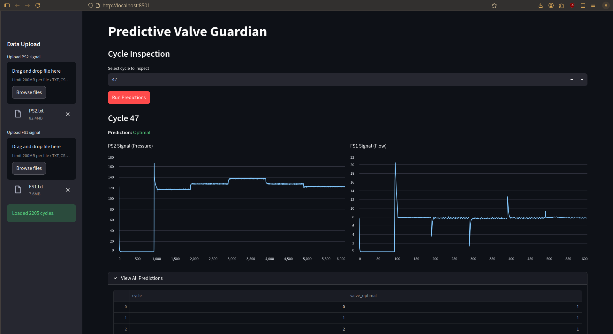

# Predictive Valve Guardian System for Hydraulic Systems

[](https://opensource.org/licenses/Apache-2.0)
[](https://www.python.org/)

This repository contains code to predict the valve condition of a hydraulic system based on sensor data.

<div align="center">
  
</div>


## Summary

- [Quickstart](#quickstart)
- [Problem Statement](#problem-statement)
- [Solution](#solution)
- [Conclusion](#conclusion)

## Quickstart

### Setup Environment

Install: Docker or directly the uv package manager.

```bash
# (Optional) uv sync
make sync
# (Optional) dev environment
make dev_setup # install black/isort/pre-commit/flake8 and setup pre-commit hooks
```

### Dashboard

Launch the dashboard server.
We use streamlit because it's simple and efficient for quick prototyping.

```bash
# Launch dashboard
make dashboard

# Launch dashboard with docker
make dashboard_docker # the first build can be long (2 minutes for me)
```

You can then access the dashboard at: [http://localhost:8501](http://localhost:8501)

### Play with the Processor

```bash
# Retrieve the data
make retrieve_data

# (Optional) Retrain the model
make train_model

# Test the model
make test_model

# Verify model estimation
make model_estimation
```

## Problem Statement:

We acquire data from:

- https://archive.ics.uci.edu/dataset/447/condition+monitoring+of+hydraulic+systems

A cycle is a complete operation of the valve guardian system.\
We have $C=2205$ cycles of data from a valve guardian system.\
At each cycle $i < C$ we have $X_i$ composed of:

- $PS2_i$: Pressure Sensor 2 value
  - in bar
  - 100Hz, fixed length
  - i.e. a time series of 6000 values
- $FS1_i$: Flow Sensor 1 value
  - in liters per second
  - 10 Hz, fixed length
  - i.e. a time series of 600 values

And also:

- $Profile_i$: Profile value
  - (cooler, $z_i$ = valve_condition, pump, accumulator, stable flag)
  - $z_i \in \{73, 80, 90, 100\}$

We want to estimate if `valve_condition == 100` at each cycle $i$.

- i.e. $z_i = 100$

So we are trying to learn a function:

- $f_\theta: \Bbb R^{6000} \times \Bbb R^{600} \to {0, 1}$

We use the $2000$ first cycles as training set, and the $205$ last cycles as test set.

## Solution

Observations:

1. The variable to predict is categorical and we are interested in one category, it's a binary classification problem.
2. The data we have are times series of fixed length, so we can use classical machine learning models.
3. Their values seems to oscillate, so we can try to perform some feature engineering to extract relevant features.

I Will try the following feature engineering:

- Raw data: Use the raw time series as features.
- Statistical features: Extract statistical features (mean, std, min, max, etc.) from
  - Order 0: directly on the time series
  - Order 1: on the first derivative of the time series
  - Order 2: on the second derivative of the time series
- FFT features: Extract features from the Fast Fourier Transform of the time series.

I will try the following models:

- LogisticRegression
- RandomForest
- XGBoost
- 1D-CNN or LSTMs to encode the time series directly.
  - challenge: the
  - If will try those approeach only if the classical models don't work well enough.
    - $\implies$ Finally it was not necessary.

### Result

<div>
<table border="1" class="dataframe">
  <thead>
    <tr style="text-align: right;">
      <th></th>
      <th>data</th>
      <th>feature_order</th>
      <th>fft</th>
      <th>model</th>
      <th>accuracy</th>
      <th>f1</th>
      <th>total_execution_time</th>
      <th>feature_time</th>
      <th>predict_time</th>
    </tr>
  </thead>
  <tbody>
    <tr>
      <th>2</th>
      <td>raw</td>
      <td>0</td>
      <td>False</td>
      <td>XGBoost</td>
      <td>1.000000</td>
      <td>1.000000</td>
      <td>0.856224</td>
      <td>0.854316</td>
      <td>0.001909</td>
    </tr>
    <tr>
      <th>0</th>
      <td>raw</td>
      <td>0</td>
      <td>False</td>
      <td>LogisticRegression</td>
      <td>1.000000</td>
      <td>1.000000</td>
      <td>0.863043</td>
      <td>0.854316</td>
      <td>0.008727</td>
    </tr>
    <tr>
      <th>1</th>
      <td>raw</td>
      <td>0</td>
      <td>False</td>
      <td>RandomForest</td>
      <td>1.000000</td>
      <td>1.000000</td>
      <td>0.870389</td>
      <td>0.854316</td>
      <td>0.016073</td>
    </tr>
    <tr>
      <th>9</th>
      <td>features</td>
      <td>0</td>
      <td>True</td>
      <td>LogisticRegression</td>
      <td>1.000000</td>
      <td>1.000000</td>
      <td>1.149279</td>
      <td>1.149080</td>
      <td>0.000198</td>
    </tr>
    <tr>
      <th>11</th>
      <td>features</td>
      <td>0</td>
      <td>True</td>
      <td>XGBoost</td>
      <td>1.000000</td>
      <td>1.000000</td>
      <td>1.149786</td>
      <td>1.149080</td>
      <td>0.000705</td>
    </tr>
    <tr>
      <th>10</th>
      <td>features</td>
      <td>0</td>
      <td>True</td>
      <td>RandomForest</td>
      <td>1.000000</td>
      <td>1.000000</td>
      <td>1.161994</td>
      <td>1.149080</td>
      <td>0.012914</td>
    </tr>
    <tr>
      <th>12</th>
      <td>features</td>
      <td>2</td>
      <td>True</td>
      <td>LogisticRegression</td>
      <td>1.000000</td>
      <td>1.000000</td>
      <td>1.841412</td>
      <td>1.841241</td>
      <td>0.000171</td>
    </tr>
    <tr>
      <th>14</th>
      <td>features</td>
      <td>2</td>
      <td>True</td>
      <td>XGBoost</td>
      <td>1.000000</td>
      <td>1.000000</td>
      <td>1.841947</td>
      <td>1.841241</td>
      <td>0.000706</td>
    </tr>
    <tr>
      <th>13</th>
      <td>features</td>
      <td>2</td>
      <td>True</td>
      <td>RandomForest</td>
      <td>1.000000</td>
      <td>1.000000</td>
      <td>1.854308</td>
      <td>1.841241</td>
      <td>0.013067</td>
    </tr>
    <tr>
      <th>5</th>
      <td>features</td>
      <td>1</td>
      <td>False</td>
      <td>XGBoost</td>
      <td>0.951220</td>
      <td>0.934211</td>
      <td>1.463776</td>
      <td>1.463037</td>
      <td>0.000739</td>
    </tr>
    <tr>
      <th>4</th>
      <td>features</td>
      <td>1</td>
      <td>False</td>
      <td>RandomForest</td>
      <td>0.936585</td>
      <td>0.918239</td>
      <td>1.476660</td>
      <td>1.463037</td>
      <td>0.013623</td>
    </tr>
    <tr>
      <th>8</th>
      <td>features</td>
      <td>2</td>
      <td>False</td>
      <td>XGBoost</td>
      <td>0.936585</td>
      <td>0.918239</td>
      <td>1.789581</td>
      <td>1.788842</td>
      <td>0.000739</td>
    </tr>
    <tr>
      <th>7</th>
      <td>features</td>
      <td>2</td>
      <td>False</td>
      <td>RandomForest</td>
      <td>0.936585</td>
      <td>0.918239</td>
      <td>1.802702</td>
      <td>1.788842</td>
      <td>0.013860</td>
    </tr>
    <tr>
      <th>6</th>
      <td>features</td>
      <td>2</td>
      <td>False</td>
      <td>LogisticRegression</td>
      <td>0.604878</td>
      <td>0.643172</td>
      <td>1.789066</td>
      <td>1.788842</td>
      <td>0.000224</td>
    </tr>
    <tr>
      <th>3</th>
      <td>features</td>
      <td>1</td>
      <td>False</td>
      <td>LogisticRegression</td>
      <td>0.580488</td>
      <td>0.629310</td>
      <td>1.463191</td>
      <td>1.463037</td>
      <td>0.000154</td>
    </tr>
  </tbody>
</table>
</div>

## Conclusion:

Remarks:

- Raw model and FFT features with classical models give the best results (perfect accuracy and f1-score).
- We will not use the raw model because of the high dimensionality of the data, which can lead to overfitting and high computational cost.

We will use the FFT features, with 0th-order features with XGBoost model for the final implementation.
Following the MDP (minimal description length principle), it provides a good balance between accuracy and computational efficiency.
